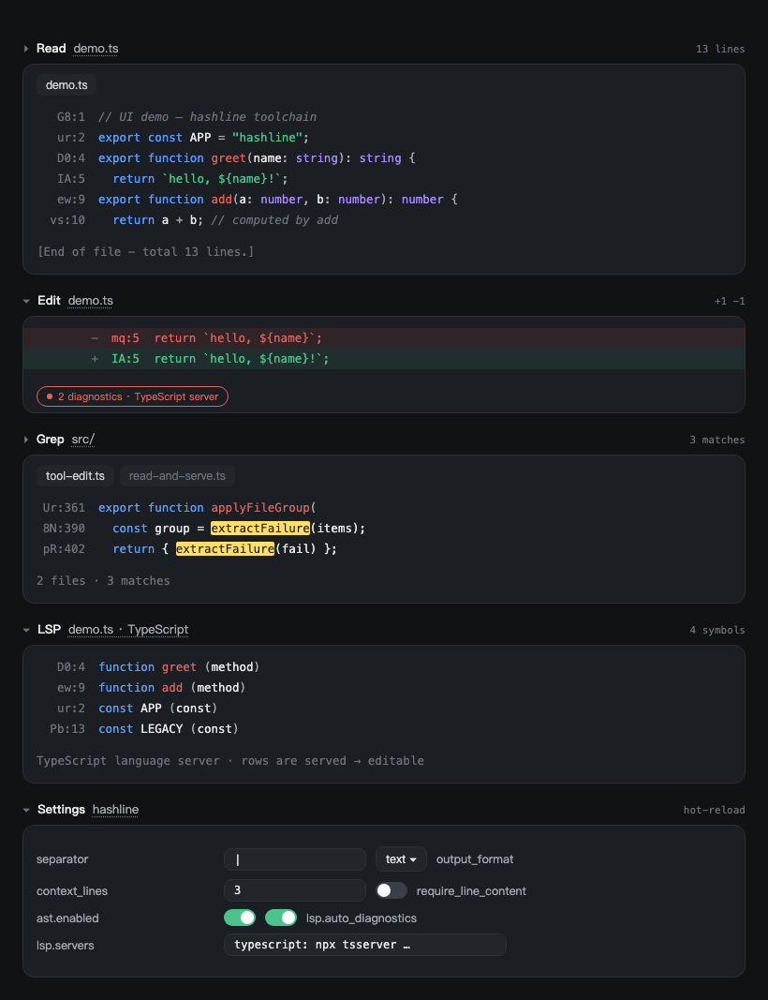

<h1 align="center">dsh-hashline-edittool</h1>

<p align="center">
  
</p>

<p align="center">
  <strong>DeepSeek Harness 的行锚定编辑工具<br>
  每一行都有一个变长内容锚点 —— 不写行号、不回抄旧代码，更省 token，把上下文留给真正的工作。</strong>
</p>

<p align="center">
  <a href="README.md">English</a> ·
  <strong>简体中文</strong>
</p>

<p align="center">
  <a href="#快速开始">快速开始</a> •
  <a href="#锚点契约">锚点契约</a> •
  <a href="#工具">工具</a> •
  <a href="#设置">设置</a> •
  <a href="#错误码">错误码</a> •
  <a href="#架构">架构</a> •
  <a href="#致谢">致谢</a>
</p>

<p align="center">
  
  
  
  
  
</p>

---

## 它是什么

一个 [DeepSeek Harness](https://github.com/deepseek-ai) 插件：用**哈希锚定**版本替换内置的
`read` / `edit` / `grep` 工具，并在此基础上提供 `undo_last_edit`、`ast_grep`、`ast_edit`
和 `lsp` 工具：

- **每一行都携带内容锚点** —— 变长 Base62 标记（前 3,844 行只需 2 个字符，随文件规模
  才会增长）。模型按标记编辑，永远不需要回抄要替换的代码。
- **编辑会对照模型实际看到的内容做校验。** 每个解析出的范围都会对照 *served* 镜像
  （锚点 + 内容）验证；行在会话期间被外部改动时会以 `[E_STALE]` 拒绝 —— 而拒绝信息会
  回显当前行**并附带可直接使用的新鲜锚点**（reject-and-serve）。
- **一次调用 = 一个原子批次。** 同一 `edit` 调用里的所有锚点都对照原始快照解析；任何
  一条失败即整批拒绝、什么都不写。多文件批次按文件分组，每个文件独立 all-or-nothing，
  部分成功会被明确上报。
- **一切皆卡片。** 随包的 client 插件从结构化 `presentationMeta` 在 dsh web UI 渲染
  读 / diff / grep / 撤销 / 写入 / 结构 / LSP 卡片 —— 模型文本与 UI 永远不需要靠字符串
  解析达成一致。

以单个 npm 包（`dsh-hashline-edittool`）交付：宿主插件 + web 卡片插件 + prompt sections，
由一个 bundle patch 挂载。

## 快速开始

```sh
npx @deepseek-ai/dsh plugin --profile web add github:hyperion2144/dsh-hashline-edittool   # 从 github
npx @deepseek-ai/dsh plugin --profile web add dsh-hashline-edittool                       # 从 npm
npx @deepseek-ai/dsh plugin --profile web add /path/to/dsh-hashline-edittool              # 本地检出
```

该 profile 的下一个会话即装即用。验证层已挂载：

```sh
dsh --profile <name> --dump-config   # 会出现 "# == dsh-hashline-edittool" 层
```

| 要求 | |
| --- | --- |
| Node | `^22.19.0 \|\| >=24.0.0`（dsh 的要求；存储使用 `node:sqlite`） |
| Profile | 一个 dsh profile（首次使用 `dsh plugin` 会自动初始化） |
| 后端 | 支持沙箱 / 远程文件系统（写入走 `ctx.fs`） |

## 锚点契约

### 标记

- 锚点是变长 Base62 标记，**每行唯一**（内容相同的行拿到*不同*的锚点 —— 锚点是行身份，
  不是可以猜的内容哈希）。全数字的编码会被跳过，所以标记永远不会是纯数字。
- 标记写作 `<anchor>` 或 `<anchor>:<line>`；`line` 只是**位置提示** —— 锚点才是权威，
  提示与锚点不一致只给警告（`[E_LINE_HINT]`），不是错误。旧的 `<line>:<anchor>` 顺序
  仍然接受。
- `read` 输出以 `ANCHOR:FILELINE` 头开始，分隔标记列与逐字内容，使用配置的分隔符
  （下例为 `|`）：

```text
ANCHOR:FILELINE
G8:1|// UI 演示文件
ur:2|export const APP = "hashline";
D0:4|export function greet(name: string): string {
```

### 已读状态校验（reject-and-serve）

工具结果向模型展示过的行即成为 **served**（`read`、`grep`、编辑 diff、结构结果、LSP
行）。`edit` 在写入前对照该镜像验证每个解析出的范围：

- 锚点未知或行从未 served → `[E_RANGE_UNSERVED]` / `[E_RANGE_UNVERIFIED]`；
- served 内容与磁盘不一致 → `[E_STALE]` / `[E_RANGE_STALE]`；
- 每次拒绝都会**把当前行作为 served 行回显并附带新鲜锚点** —— 修复方式就是：取回显里
  的标记重新提交。served 行同时以 `fs/observed` 发出，立即可写。

没有 `Shift:` 块 —— 编辑之后，从响应刚给出的 diff 行取锚点，或者重新 read。

### 批量语义

- `edits[]` **按序作用于同一快照**；范围重叠是 `[E_BATCH_CONFLICT]`；任何失败是
  `[E_BATCH_ABORT]` —— 什么都不写。
- 使用逐条 `path`（或每条都带 `path`）时，条目按文件分组，每个文件**独立
  all-or-nothing**；结果聚合为 `success[]` / `fail[]`（多文件形态）。
  `item.path === topLevelPath` 自动折叠为缺省。
- 每次调用最多 32 条编辑。

### `op` 语义

| op | 锚点字段 | 行为 |
| --- | --- | --- |
| `replace` | `anchor_start`（+ 可选 `anchor_end`） | 用 `lines` 换掉该范围（非空；`[""]` 把行清成空行，区别于 `del`）。省略 `anchor_end` = 单行替换；**`lines` 跨多行时必填**。 |
| `ins` | `anchor_after` | 在该行**下方**插入 `lines` —— 锚点行保留，`lines` 只放新内容。`anchor_start`/`anchor_end` 会被拒绝。可以锚在其他 hunk 范围的**结束行**，绝不能是起点或内部。 |
| `del` | `anchor_start`（+ 可选 `anchor_end`） | 删除范围（或单个 `anchor_start` 行）；`lines` 被忽略。 |
| `sed` | `anchor_start`（+ 可选 `anchor_end`） | 用 `pattern` + `replacement` + 可选 `flags`（`gims`）**逐行**重写范围；不放 `lines`，`replacement` 不得含换行；sed 的 `\1`/`&` 与 JS 的 `$1`/`$&` 都接受。 |

锚点字段与 op 不匹配是 `[E_BAD_SHAPE]`。

### `require_line_content`（可选加固）

开启 `hashline.require_line_content` 后，每个锚点变成 `{ anchor, line }` 对 —— `line`
是你对该行**当前完整文本**的声明。声明在陈旧锚点检查之后验证；不匹配则以
`[E_CONTENT_MISMATCH]` 拒绝整次调用，并回显你声明的内容实际所在的位置。

## 工具

| 工具 | 功能 |
| --- | --- |
| `read` | 文件即 served 行：`ANCHOR:FILELINE` 头 + `<anchor>:<line>` 标记（`line_numbers: false` 得到裸锚点）。`offset`（1 起）/ `limit` 分页；超长行（>200KB）变成标记 + `sed` 提示 —— 锚点需要完整行。 |
| `edit` | 通过 `{ path?, edits: [{ op, … }, …] }` 应用一或多条范围编辑 —— 完整契约见[上节](#锚点契约)。取代旧的 `batch_edit`。 |
| `write` | 完全影子化：创建/覆盖文件，返回写入结果**外加带新鲜锚点的自动 read 预览**，下一次编辑不再需要单独 read。 |
| `grep` | JavaScript 正则搜索（`regex: false` 为字面量），跨路径树逐文件一节、同一表头，只输出完整行。`-C N` 回显上下文行；命中即 served → 可直接编辑。 |
| `undo_last_edit` | `{ path }` 撤销该文件最后一次 hashline 编辑 —— 仅当文件仍与存储的编辑后内容一致时；可跨重启。 |
| `ast_grep` | 按语法形状结构搜索（`pat` 使用 `$NAME` / `$$$ARGS` / `$_` 元变量）。模式无法解析为单一节点时拒绝而不是猜测。长文件返回可编辑的折叠大纲。 |
| `ast_edit` | 结构改写：按形状找到位置，把变更交给 `edit` **同一引擎** —— served 校验、undo 记录、diff 与语法门全部生效。 |
| `lsp` | 能起语言服务器就做符号级工作（按语言启动，与 dsh 的 `lsp` 服务共享）；否则降级启发式后端。其行会被 serve，因此 LSP 输出可直接编辑。 |

### 输出模式

`hashline.output_format` 切换面向模型的文本：

- **`text`**（默认）—— 上文的 `ANCHOR:FILELINE` 行格式；
- **`json`** —— 纯 JSON 信封（如 edit 返回 `{ ok, path, diff, hints, warnings }`，
  `diff` 是 `{"<锚点>:<行>": 内容}` 字典）。结构化，适合偏好解析的模型。

web 卡片不受影响 —— 它们从 `presentationMeta` 渲染，永远结构化。

## 设置

所有键位于 dsh 设置的 `hashline` 命名空间（`~/.dsh/settings.yaml`），全部可选，且
**热更新**：提交的改动在下一次工具调用即生效，无需重启。

```yaml
hashline:
  separator: "|"           # 标记/内容列分隔符（默认 ":"）
  output_format: text      # "text" | "json"
  context_lines: 3         # 陈旧回显 / diff 的上下文行数（0..20）
  require_line_content: false
  ast:
    enabled: true
    languages: {}          # 按语言收窄：{ <id>: { enabled: false } }
  lsp:
    servers: {}            # 命名服务器：{ <languageId>: <command> }
    auto_diagnostics: true # 写入后内联投递服务器诊断
```

### 按 preset 配置指引

`tool:read` / `tool:edit` / `tool:grep` / `tool:undo_last_edit` 指引段是插件共享目录里
按 preset id 存放的纯 markdown 覆盖文件 —— 见
[`docs/adr/0001`](docs/adr/0001-guidance-override-files.md)。清空文件即重置为编译默认；
front-matter 围栏损坏会快速失败并告警。

## 错误码

| 代码 | 含义 |
| --- | --- |
| `[E_ACCESS]` | 文件存在但不可读/不可写。 |
| `[E_BAD_OP]` | 范围终点在起点之前（方向颠倒时自动纠正）。 |
| `[E_BAD_REF]` | 锚点字段不是从行首列复制的标记。 |
| `[E_BAD_SHAPE]` | 请求/字段形状错误（未知字段、op 与锚点字段不匹配等）。 |
| `[E_BATCH_ABORT]` | 批内一条失败；什么都没写。 |
| `[E_BATCH_CONFLICT]` | 两条目在同一快照上范围重叠。 |
| `[E_CONTENT_MISMATCH]` | （require_line_content）声明的 `line` 不匹配。 |
| `[E_ELISION_IN_PAYLOAD]` | 载荷携带大纲标记 `…`；警告，编辑继续。 |
| `[E_HASH_SPACE]` | 锚点空间耗尽（> 62⁸ 行）。 |
| `[E_INS_ANCHOR_DUP]` | `ins` 的 `lines[0]` 与锚点行重复；警告，继续。 |
| `[E_INVALID_PATCH]` | diff 预览标记被粘进 `lines`；剥除并警告。 |
| `[E_LINE_HINT]` | `<line>:<anchor>` 提示与锚点不一致；以锚点为准。 |
| `[E_LINE_REF]` | 锚点字段传了纯数字；安全时按 served 状态解析。 |
| `[E_NOOP_LOOP]` | 同一编辑反复无变化；再提交被拒绝。 |
| `[E_NOT_FOUND]` / `[E_NOT_TEXT]` | 文件不存在 / 目录-二进制-非 UTF-8。 |
| `[E_NOT_OBSERVED]` | 本会话未观察过该文件（先读后写策略）。 |
| `[E_OP_INS]` | 提示：`ins` 已把行插入锚点之后。 |
| `[E_PASTE_DUP]` | 替换行与相邻文件行相同；原样保留。 |
| `[E_RANGE_STALE]` / `[E_RANGE_UNSERVED]` / `[E_RANGE_UNVERIFIED]` | served 校验失败；范围已回显为新鲜行。 |
| `[E_STALE]` | 锚点不再匹配 served 内容；重新 read。 |
| `[E_SYNTAX_AFTER_EDIT]` | `ast_edit` 的替换会让文件无法解析；未写入。 |
| `[E_UNDO_STALE]` / `[E_UNDO_UNAVAILABLE]` | 编辑后文件被改动 / undo 历史无法持久化。 |
| `[E_WOULD_EMPTY]` | 编辑会把非空文件清空；请用 `write`。 |
| `[E_WIN_REPLACE]` | Windows 原子替换被其他进程占用。 |
| `[E_AST_DISABLED]` / `[E_AST_PATTERN]` / `[E_AST_TOO_LARGE]` / `[E_AST_WORKER_ABORTED]` / `[E_AST_WORKER_FAILED]` / `[E_PARSE_FAILED]` | AST 能力：按语言关闭 / 模式无法解析为单一节点 / 超过 AST 大小上限 / worker 中止 / worker 失败 / 文档解析失败。 |
| `[E_GRAMMAR_BUILTIN]` / `[E_GRAMMAR_NO_DESCRIPTOR]` / `[E_GRAMMAR_UNKNOWN]` | 语法目录：内置名冲突 / 该语言无描述符 / 未知语言。 |
| `[E_GRAMMAR_FETCH_FAILED]` / `[E_GRAMMAR_HASH_MISMATCH]` / `[E_GRAMMAR_NOT_IN_TARBALL]` | 语法下载失败 / SHA-256 不匹配 / tarball 中缺少条目。 |
| `[E_LSP_NO_SERVER]` / `[E_LSP_BAD_OPERATION]` / `[E_LSP_UNAVAILABLE]` / `[E_LSP_ABORTED]` / `[E_LSP_CLOSED]` / `[E_LSP_NOT_READY]` / `[E_LSP_TIMEOUT]` | LSP：该语言无服务器 / 操作无效 / 服务器不可用 / 请求中止 / 通道已关闭 / 仍在启动 / 超时。 |
| `[E_BARE_HASH_PREFIX]` | `lines` 中粘入了带锚点前缀的行；剥除并警告。 |
| `[E_ANCHOR_AMBIGUOUS]` | 锚点同时活在多行上（被释放的锚点在模型仍持旧绑定时被重新分配）——拒绝；请重新 read。未写入任何内容。 |

## 存储

锚点身份、served 行与 undo 历史保存在**按工作区键控**的一个 SQLite 存储中：

```
$DSH_HOME/plugins/dsh-hashline-edittool/<projectKey>/hash-store.sqlite
```

`<projectKey>` 是会话 cwd 的人类可读编码，并行工作区之间永不共享锚点与 undo 历史。
工作区之外的调用方回落到共享主目录存储。served 行按 7 天 TTL 清理；损坏的存储自动
隔离重建。

## 架构

一个插件，三个平面：

```text
src/
├── index.ts              # 入口：挂载工具、设置、LSP、语法路由
├── config.ts             # 设置 schema + 接线（热更新）
├── tools/                # 8 个工具入口 —— 薄壳，不做 IO
├── domain/
│   ├── edit/             # 编辑引擎、变更事务、契约、prompts
│   └── session/          # served 状态、hash store、文件视图
├── render/               # 按卡片的投影：读 / 编辑 / grep 卡、diff 渲染器
├── contract/             # 请求形状 + 校验（schema 是唯一权威）
├── hashline/             # 锚点核心：分配、resolve/apply 引擎
├── infra/                # fs 桥、沙箱、路径、设置快照、工作区作用域
├── lsp/                  # 语言服务器会话、自动诊断
├── ast/                  # tree-sitter worker、语法注册表
└── guidance/             # 按 preset 的指引解析 + 物化
client/                   # web 卡片插件（同一包）
test/                     # 1,210 个测试
```

依赖只指向一个方向：`tools → domain → render/contract → hashline/infra`。卡片从结构化
`presentationMeta` 渲染；模型文本与 UI 永远不互相解析。领域词汇表见
[`CONTEXT.md`](CONTEXT.md)，契约背后的决策见 [`docs/adr/`](docs/adr/)。

## DSH 版本支持

兼容性通过 settings 服务对等依赖声明（`@deepseek-ai/dsh-settings >=0.1.2-rc.0`，
npm 强制），并在本仓库实际运行的 harness 上验证：

| dsh 版本 | 插件版本 | 说明 |
| --- | --- | --- |
| **0.1.5-rc.2**（当前环境，实测通过） | **0.7.x** | 统一锚点生命周期、AST/LSP 拆分、设置卡片、卡片全景图 |
| ≥ 0.1.2-rc.0 | 0.6.x | 自渲染卡片、按工作区存储、设置面板 |
| 0.1.2 | 0.4.x – 0.5.x | v2 动态锚点；dsh 0.1.2 web 卡片适配完成（#69） |
| 0.1.2（早期） | 0.1.x – 0.3.x | 旧 `line#hash` 锚点、batch_edit |

- 构建/测试 SDK 基线：`0.1.2-rc.1`；实测环境 dsh `0.1.5-rc.2`。
- 更新的 dsh 0.1.x/rc 线预期可用；发现回归请提 issue。

## 开发

```sh
npm run typecheck   # tsc --noEmit（src + test 两个工程）
npm test            # vitest
npm run build       # 清理 lib/ + tsc + client 工作区
```

发布是**先打 tag**：`npm run release -- X.Y.Z` 升版本、移动 changelog、打 `vX.Y.Z` 标签
并推送 —— tag 触发 GitHub Actions 发布流程。tag 存在之前 `npm publish` 会被阻止。PR
优先；正文写 `Closes #NN`。见 [`.agents/skills/git-std.md`](.agents/skills/git-std.md)。

## 许可证

[MIT](LICENSE)

## 致谢

本项目 **fork 自
[**Rianico/dsh-better-edit**](https://github.com/Rianico/dsh-better-edit)**，此后独立维护
—— 感谢 [@Rianico](https://github.com/Rianico) 打下的基础，以及把哈希锚定编辑带给
DeepSeek Harness 用户。

那个 fork 本身也站在 hashline 谱系之上，本项目一并感谢：

- [**pi-hashline-edit**](https://github.com/RimuruW/pi-hashline-edit)（RimuruW）—— 引入
  内容哈希与冲突消解的原创 pi-coding-agent 扩展；
- [**pi-hashline-edit-pro**](https://github.com/YuGiMob/pi-hashline-edit-pro)（YuGiMob）
  —— 本仓库 hashline 核心所移植自的加固版 fork；
- Can Bölük 的 [*The Harness Problem*](https://stencil.so/blog/the-harness-problem) ——
  证明了瓶颈在 harness 而非模型的那篇文章。

延伸阅读：[Hash anchors + Myers diff + single-token anchors
(dirac.run)](https://dirac.run/posts/hash-anchors-myers-diff-single-token) 与独立的
[hashline 与 replace 对比基准](https://nwyin.com/blogs/hashline-vs-replace-edit-bench.html)。

---

## Star History

[](https://star-history.com/#hyperion2144/dsh-hashline-edittool&Date)

---

<p align="center">
  <strong>⭐ 如果 hashline 编辑让 Agent 的编辑更可靠，就给它一个 star 吧！</strong>
</p>
